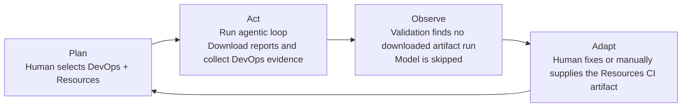
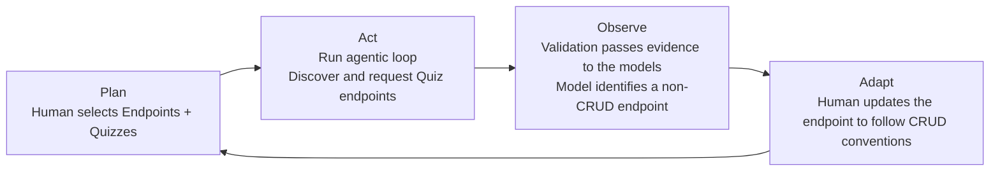

# Plan → Act → Observe → Adapt

## Learning Resource Manager — DevOps

```mermaid
flowchart LR
    P["Plan<br/>Human selects DevOps + Resources"]
    A["Act<br/>Run agentic loop<br/>Download reports and collect DevOps evidence"]
    O["Observe<br/>Validation finds no downloaded artifact run<br/>Model is skipped"]
    D["Adapt<br/>Human fixes or manually supplies the Resources CI artifact"]

    P --> A --> O --> D --> P
```

## Quiz Manager — Endpoints

```mermaid
flowchart LR
    P["Plan<br/>Human selects Endpoints + Quizzes"]
    A["Act<br/>Run agentic loop<br/>Discover and request Quiz endpoints"]
    O["Observe<br/>Validation passes evidence to the models<br/>Model identifies a non-CRUD endpoint"]
    D["Adapt<br/>Human updates the endpoint to follow CRUD conventions"]

    P --> A --> O --> D --> P
```
