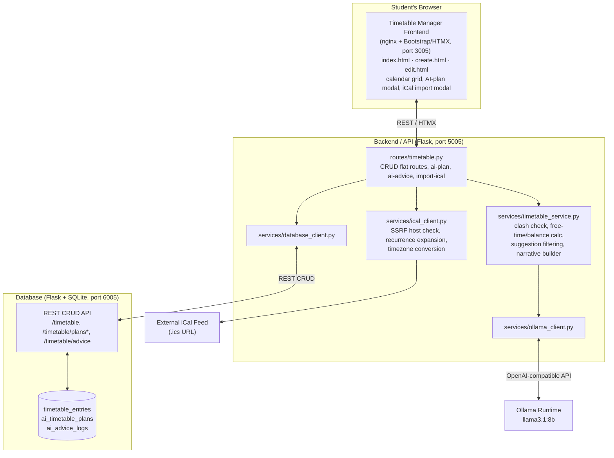

# Individual Report Section — Timetable Manager
**Student:** [Your Name] | **Feature:** Timetable Manager | **Release:** 0

> This section covers the five individual deliverables required in the Release 0 technical report:
> feature allocation, functional/non-functional requirements, feature plan, risk management plan,
> and individual software architecture diagram. Drop this directly into the shared group report and
> fill in the bracketed placeholders (name, dates, sprint numbers) to match your team's actual plan.

---

## 1. Individual Feature Allocation

**Feature name:** Timetable Manager

**Brief feature description:**
Lets a student manage their own weekly schedule (classes, study blocks, work, and personal time)
as an hour-by-hour calendar grid (8am–11pm, one column per day), with two AI-assisted capabilities
built on Ollama: generating an optimised weekly study plan grounded in real time-management
research, and answering free-text time-management questions using the student's current week as
context. It also supports importing a class schedule directly from an external iCal (`.ics`) feed.

**Frontend microservice description:**
A multi-page Bootstrap 5 + HTMX site (`index.html`, `create.html`, `edit.html`, shared
`navbar.html` partial, `app.js`, `calendar.css`) served by nginx on port `3005`. Renders the weekly
calendar grid with previous/next-week navigation and a "Today" button, positions entries by actual
time/duration (with side-by-side lanes for rare overlapping legacy data), and drives the
create/edit/delete forms, the AI weekly-plan modal, the AI advice panel, and the iCal import modal.
`app.js` prefills the student's username from the shared `username` cookie set by the access
service, matching the convention used by the Subjects and Quiz Manager frontends. Both AI actions
show a live "Ns elapsed" counter while the model is generating.

**Backend/API microservice description:**
A Flask application on port `5005` exposing HTMX-form-friendly flat routes: `GET /timetable`
(calendar-grid fragment for the current or selected week), `GET /timetable/{id}` and
`GET /timetable/{id}/edit`, `POST /timetable` / `POST /timetable/update` / `POST /timetable/delete`
for CRUD, `POST /timetable/ai-plan` and `POST /timetable/ai-advice` for the two Ollama-backed
features, and `POST /timetable/import-ical` for schedule import. All create/edit paths run through
a shared clash-check (`_find_clash`) before touching the database, so no-overlap is enforced
server-side, not just suggested in the UI. `ollama_client.py` calls `llama3.1:8b` through the
OpenAI-compatible Ollama API for both AI features; `ical_client.py` fetches and parses external
`.ics` feeds (recurrence expansion via `recurring-ical-events`, SSRF/host validation, 5MB cap,
`zoneinfo`-based timezone conversion to `Australia/Sydney`).

**Database microservice description:**
A Flask + SQLite service on port `6005` exposing a JSON CRUD REST API
(`GET/POST/PUT/DELETE /timetable/<id>`, plus `/timetable/plans*` and `/timetable/advice`),
matching the convention used by the Subjects and Quiz Manager database services. Owns three
tables: `timetable_entries` (username, date, day_of_week, start_time, end_time, activity_name,
category, notes, `ai_generated` flag, `all_day` flag, trigger-maintained `last_updated`),
`ai_timetable_plans` (one evolving row per student with `plan_text` and JSON-encoded
`suggested_entries` so a reused plan still shows its original suggestions), and `ai_advice_logs`
(append-only question/answer history). Seeded with 16 timetable entries across 3 students, 10 AI
plan rows, and 10 AI advice log rows — satisfying the 10-row-per-table minimum.

---

## 2. Functional & Non-Functional Requirements (added to sprint backlog)

| ID | Type | Requirement | Sprint |
|----|------|-------------|--------|
| TT-F01 | Functional | Student can view their weekly timetable as an hour-by-hour grid (8am–11pm) with previous/next-week navigation. | [Sprint N] |
| TT-F02 | Functional | Student can create a timetable entry (date, start/end time, activity name, category, notes) from the grid or a form. | [Sprint N] |
| TT-F03 | Functional | Student can edit or delete an existing timetable entry. | [Sprint N] |
| TT-F04 | Functional | System rejects a create/edit that would overlap an existing entry on the same day, naming the clashing entry. | [Sprint N] |
| TT-F05 | Functional | Student can request an AI-generated weekly study plan; suggested Study blocks are shown overlaid on the real calendar and can be added individually or all at once. | [Sprint N] |
| TT-F06 | Functional | Student can ask a free-text time-management question and receive AI advice grounded in their current week's entries. | [Sprint N] |
| TT-F07 | Functional | Student can import a class schedule from an external iCal URL, including recurring events, over a configurable forward-looking window. | [Sprint N] |
| TT-F08 | Functional | Imported due-date/all-day events (from iCal) are shown as a pill banner above the grid, not as hourly blocks, and never clash-check against timed entries. | [Sprint N] |
| TT-NF01 | Non-functional | All CRUD and AI endpoints validate input server-side (date format, `HH:MM` time format, allowed categories, field length limits) independently of frontend constraints. | [Sprint N] |
| TT-NF02 | Non-functional | Each database table is seeded with a minimum of 10 records; seed data must satisfy the same clash/category rules as user-entered data. | [Sprint N] |
| TT-NF03 | Non-functional | The iCal import endpoint validates the target host to prevent SSRF (rejects `localhost`/private/loopback/link-local addresses) and caps fetched content at 5MB. | [Sprint N] |
| TT-NF04 | Non-functional | AI-generated content (weekly plan) must not be trusted blindly: every suggestion is re-verified against the same clash logic used for manual entries before being shown to the student. | [Sprint N] |
| TT-NF05 | Non-functional | Long-running AI requests (~1–3 minutes on CPU-only inference) must give the user live feedback (elapsed-time counter) rather than an unexplained wait. | [Sprint N] |
| TT-NF06 | Non-functional | The service is fully containerised (frontend/backend/database) and integrates into the shared `docker-compose.yml` on ports 3005/5005/6005 per the project's port scheme. | [Sprint N] |

---

## 3. Feature Plan

| Week / Sprint | Task |
|---|---|
| [Week X] | Design database schema (`timetable_entries`, `ai_timetable_plans`, `ai_advice_logs`); write `init_db.py` with seed data. |
| [Week X] | Build database microservice CRUD REST API (port 6005) and Dockerfile. |
| [Week X] | Build backend/API Flask routes (port 5005): CRUD flat routes, `_find_clash` overlap validation. |
| [Week X] | Build frontend calendar grid (index/create/edit HTMX pages, `app.js`, `calendar.css`) on port 3005; wire up to backend. |
| [Week X] | Integrate Ollama (`llama3.1:8b`); implement AI weekly-plan generation (`timetable_service.py`: free-time, clash, and balance computation) and AI advice endpoint. |
| [Week X] | Implement iCal import (`ical_client.py`): fetch/parse `.ics`, recurrence expansion, timezone conversion, SSRF host validation. |
| [Week X] | Write `timetable.yml` GitHub Actions workflow (build → smoke-check → evidence upload). |
| [Week X] | Integrate into shared `docker-compose.yml` and Learning Hub home page; apply shared CSS/navbar. |
| [Week X] | Local testing pass, capture evidence (screenshots, workflow run, Docker Compose logs), write this report section. |

*(Fill in your team's actual sprint numbers/week dates — this reflects the build order evident in the codebase.)*

---

## 4. Risk Management Plan

| Risk | Likelihood | Impact | Mitigation |
|---|---|---|---|
| Local LLM (CPU-only) is slow (~5.2 output tokens/sec measured) and multi-minute AI responses read as a hung/broken UI. | High | Medium | Added a live "Ns elapsed" counter on both AI panels instead of a static "please wait" message; bounded output with `PLAN_MAX_TOKENS=250` and raised `OLLAMA_TIMEOUT_SECONDS=240` with `OLLAMA_MAX_RETRIES=0` to avoid the SDK silently re-trying (and re-waiting for) a slow-but-working generation. |
| Small/medium local models are unreliable at multi-item reasoning (observed: inventing clashes that don't exist, skipping free days, ignoring the requested block budget, narrative describing suggestions that were later filtered out). | High | High | Redesigned the AI weekly-plan feature so the model only *places* Study blocks — all facts (free time, clashes, study/work balance) are computed in Python and handed to the model as ground truth, and the model's output is re-verified afterwards (`_drop_clashing_suggestions`, category filter, `_diversify_by_day`, `_trim_to_budget`). The narrative shown to the student is built entirely in Python from the final, filtered suggestion list — never AI-written prose — removing narrative hallucination as a possibility. |
| Importing an external iCal URL exposes an SSRF surface (a malicious `.ics` URL could target internal/private network addresses). | Medium | High | `_is_unsafe_host` rejects literal `localhost`, private, loopback, and link-local addresses before the fetch is made; fetched content is capped at 5MB. |
| No per-user timezone concept in the app (usernames are free text, no real accounts), so imported event times could land on the wrong hour depending on how the source feed encodes time (`TZID` vs. bare UTC vs. floating). | Medium | Medium | All imported timed events are explicitly converted with `zoneinfo` (DST-aware) to a single assumed `IMPORT_TIMEZONE` (`Australia/Sydney`), confirmed against a real UTS Canvas export that omits `VTIMEZONE` and encodes absolute UTC instants. |
| Re-importing the same iCal feed could duplicate every event/due-date row each time. | Medium | Low | Timed events re-use the existing `create_entry` clash check (a duplicate occurrence is skipped, not force-inserted); due-date/all-day entries (which don't clash-check) get a dedicated duplicate guard (`_find_duplicate_due` on username/date/activity name). |
| A single large AI generation could try to close a student's entire study-time gap in one response, defeating the purpose of leaving free time unscheduled. | Low | Medium | Capped a single generation at 4 Study blocks / 4 hours total, framed explicitly as one incremental step when the real gap is larger. |
| Team-wide integration risk: my feature's Docker ports (3005/5005/6005) or schema could collide with another student's service in the shared `docker-compose.yml`. | Low | High | Followed the project's fixed port-assignment scheme (position 5 → 3005/5005/6005) and kept the database schema exclusively owned by this feature (no direct cross-feature DB queries, per the app-level design). |

---

## 5. Individual Software Architecture Diagram

Three containers, following the project's standard feature-microservice shape (frontend / backend / database), plus the shared Ollama runtime:

Docker-container view (matches the team's standard per-feature diagram style, e.g. the Learning Resource Manager architecture diagram):

**Notes for the write-up:**
- This mirrors the team's standard 3-container-per-feature pattern (see [`design.md`](../../design.md)),
  slotted into port position 5 (3005/5005/6005).
- The Plan → Act → Observe → Adapt loop for this feature: **Plan** = compute free time/clashes/balance
  in Python; **Act** = call the LLM to place Study blocks / answer advice questions; **Observe** =
  re-verify every AI-returned suggestion against the real clash logic; **Adapt** = filter, diversify
  across days, and trim to budget before building the final narrative shown to the student.
- Paste the Mermaid block above into any Mermaid renderer (e.g. the [Mermaid Live Editor](https://mermaid.live))
  or a draw.io/PowerPoint diagram if your report format needs a static image instead of code.

---

## 6. `timetable.yml` CI/CD Workflow Description

Mirrors the standard per-feature workflow pattern used across the team's repository
(`.github/workflows/timetable.yml`), triggered on pull requests touching `timetable/**`,
`shared/**`, or the workflow file itself:

1. **Build Images** — `docker compose build` for the timetable service's three containers.
2. **Smoke Check** — brings the stack up with `docker compose up --detach --build`, then probes
   database (`:6005`), backend (`:5005`), and frontend (`:3005`) in that order with up to 8 retries
   (2s apart), requiring an HTTP 200 before proceeding; tears down with `docker compose down --volumes`
   (`if: always()`) regardless of outcome.
3. **Evidence Upload** — generates a JSON and Markdown report (workflow name, run ID, commit SHA,
   branch, timestamp, link to the GitHub Actions run) and uploads them as a workflow artifact.

---

## 7. Evidence to attach (not drafted here — capture from your own environment)

- Screenshot(s) of the weekly calendar grid, create/edit forms, AI weekly-plan modal, AI advice
  panel, and iCal import modal.
- A passing `timetable.yml` GitHub Actions run (screenshot or link).
- `docker compose up` output showing all three containers healthy.
- Local test evidence (manual CRUD test / clash-rejection test / AI-plan generation test).
